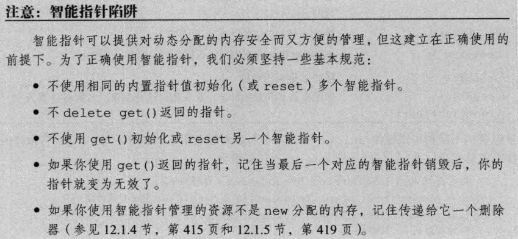
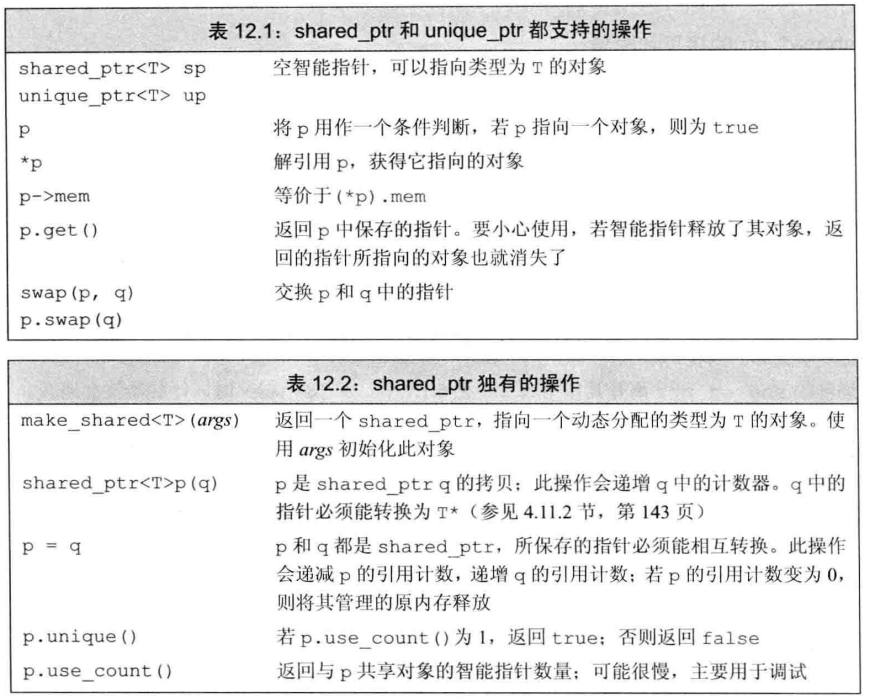
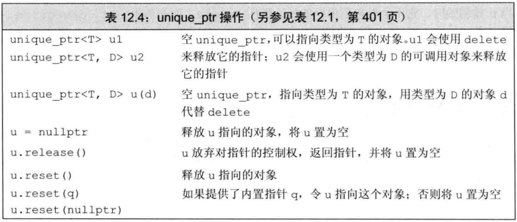

#### 1、静态内存、栈内存、动态内存

> 静态内存：存放static对象，全局变量；
>
> 栈内存：存放局部变量的值，仅在程序运行期间存在，程序结束销毁；
>
> 动态内存：堆内存，在程序运行时分配的对象，生存期需要人为的显式控制


  

#### 2、智能指针

##### 	三大智能指针：`<memory>头文件`

- **shared_ptr**
- **unique_ptr**
- **weak_ptr**

  

**动态分配对象概念**：使用运算符new来创建的一个类的对象，在**堆**上分配内存

智能指针是一种模板类：class（类似vector）

智能指针的作用：

​	确保在正确的时间释放内存，防止内存泄漏，引起非法内存访问。

  

#### 2.1  shared_ptr类	

**shared_ptr的作用：**

>允许多个指针指向相同的对象，

定义智能指针：

```c
#include <memory>

shared_ptr<string> p1;
shared_ptr<vector<int> > p2;
shared_str<int> p3(new int(42));		//传进去的参数是指针，构造一个智能指针类
```

解引用返回对象,值的赋予

```
*p1 = "hello"
```

**make_shared函数**：

​	主要任务：初始化对象的shared_ptr	

​	作用：此函数在动态内存中分配一个对象并返回指向此对象的shared_ptr指针

```cpp
shared_ptr<int> p1 = make_shared<int> (42);	//指向一个int，值为42
int *p2 = new int(42);		//基本上是等价的，但p2需要手动释放内存

//又如：
shared_ptr<string> p4 = make_shared<string>("sdfsdf");
auto p5 = make_shared<vector<string>> ();

make_shared<>(参数列表);		//传递的参数用来初始化对象


//注意：不能将一个原始指针直接赋值给一个智能指针：原因是一个是智能指针的类，一个是指针
shared_ptr<int> p4 = new int(1);	//error

```

**引用计数机制：一个对象地址给多个智能指针，内部存在计数器**

```cpp
shared_ptr<int> p1 = make_shared<int> (42);	
auto q1(p1);			
auto q2 = p1;
    
//三个指针指向的地址相同，对象一样
//引用计数，计数器递增，一旦计数器为0，自动释放对象
```


  

**定义和改变shared_ptr的方法：**

```cpp
shared_ptr<T> p(q);

p.reset();
p.reset(q);

//reset()可停止当且指针指向原先的位置，并减少计数
//当计数值为0时，自动delete堆内存中的对象
```


  

**一个简单例子：**

```cpp
class Person
{
public:
    Person(int v) {
        value = v;
        std::cout << "Cons" <<value<< std::endl;
    }
    
    ~Person() {
        std::cout << "Des" <<value<< std::endl;
    }

    int value;

};


int main()
{
    std::shared_ptr<Person> p1(new Person(1));// Person(1)的引用计数为1

    std::shared_ptr<Person> p2 = std::make_shared<Person>(2);

    p1.reset(new Person(3));// 首先生成新对象，然后引用计数减1，引用计数为0，故析构Person(1)
                            // 最后将新对象的指针交给智能指针

    std::shared_ptr<Person> p3 = p1;//现在p1和p3同时指向Person(3)，Person(3)的引用计数为2

    p1.reset();//Person(3)的引用计数为1
    p3.reset();//Person(3)的引用计数为0，析构Person(3)
    return 0;
}

```


  

##### 直接管理内存：(手动分配和释放)

> 运算符 new：分配内存，delete：释放内存

> 在自由空间分配的内存是没有名字的，因此new无法为其分配的对象命名，而是返回指向该对象的指针：

 ```cpp
int *p0 = new int();
int *p1 = new int(3);

vector<int> *p2 = new vector<int>{0, 1, 2};
 ```

> 当发生内存耗尽的情况时，new表达式会失败，默认情况下抛出bad_alloc异常

释放内存：

> delete p;
>
> 释放内存后的指针称为空悬指针，最后一定要 p = nullptr才能保证指针不
>
> 再指向任何对象

```cpp
int i, *p1 = &i;
double *p2 = nullptr;
double *p3 = new double(33);
double *p4 = p3;

delete i;		//错误，不是指针
delete p1;		//错误，指向的是一个变量地址，不在堆内存分配区
delete p2;		//正确，空指针
delete p3;		//正确，释放的是动态内存中的地址
delete p4;		//错误，p3已经被释放

//对于const动态对象的指针：它本身也可以被销毁
const int *p5 = new const int(1024);
delete p5;
```

  

> 以上是不使用智能指针的情况，可能易引发以下问题：
>
> 1、忘记delete内存，造成内存泄漏
>
> 2、使用已经释放掉的对象
>
> 3、同一块内存释放了两次
>
> 坚持使用智能指针，可以解决上述问题




简单来说就是换个方式解决动态内存：

```cpp
//一般人常用
int *p = new int(11);
delte p;

//现在用更安全的
shared_ptr<int> p = make_shared<int>(11);
```


  

#### 2.2 unique_ptr类

> 与shared_ptr不同点：
>
> 某个时刻只能有一个unique_ptr指向给定的对象，当unique_ptr被销毁
>
> 时，它所指向的对象一同被销毁；
>
> 
>
> 
>
> 

> 定义一个unique_ptr时，需要将其绑定在一个new返回的指针上

```cpp
//初始化 （没有make_shared）
unique_ptr<double> p1;
unique_ptr<int> p2(new int(42));

//不支持拷贝操作
unique_ptr<int> p3(p2);  		//错误
unique_ptr<int> p3, p3 = p2;  	//错误
```

  

**虽然不支持拷贝，但是可以将指针的所有权转移**

```cpp
//初始化时转移：
unique<int> p4(p2.release());	//release将p2置为空

//已定义指针的转移：
p4.reset(p2.release());			//release将p2置为空

//注意：release一定要有接收
p2.release();					//错误：p2不会释放内存
auto p = p2.release();			//正确
```

  

**unique_ptr的释放**

```cpp
p.reset(nullptr);
```


  

#### 2.3 weak_ptr类

> weak_ptr是一种不控制所指向对象生存期的智能指针，它指向一个shared_ptr所管理的对象！
>
> 当weak_ptr绑定到一个shared_ptr时，不会增加shared_ptr的引用计数
>
> 当shared_ptr销毁时，对象释放，weak_ptr也会跟着释放

  

**创建weak_ptr**

```cpp
//创建时，要用一个shared_ptr来初始化它
auto p = make_shared<int>(42);
weak_ptr<int> wp(p);

//wp和p指向了同一个堆内存中的对象
//由于对象肯不存在，不能使用wp直接访问对象，要用lock安全访问

if(shared_ptr<int> np = wp.lock()){
    //用np访问wp的对象是安全的
}
```

  &nbsp;

&nbsp;

#### 3、动态数组

##### 1、allocator类

 **(操作类似vector)**

作用：分配和初始化一个对象数组

 ```cpp
//一般情况下,创建要给动态string数组，分别写入
string *const p = new string[N];
string s;
string *q = p;
while(cin >> s && q != p+N)
    *q++ = s;
const int size = q-p;
delete[] p;


//allocator能帮我们将内存分配和对象构造分离
allocator<string> alloc;
auto const p = alloc.allocate(N);
auto t = p;						//t指向最后构造的元素之后的位置
alloc.construct(t++);			//*t为空字符串
alloc.construct(t++, "hi");		//*t为hi

cout << *p << endl;		//正确：接引用第一个字符串
cout << *t << endl;		//错误：类似于'\0'的下一个未分配的空间

//使用完成要销毁动态内存
while(t != p)
    alloc.destroy(--t);
//元素被销毁后，就可以重新使用这部分内存保存其它string

//释放内存
alloc.deallocate(p, N);
 ```


##### 2、new和动态数组

> 用new分配一个数组时，我们并未得到一个数组类型的对象，而是得到一个指向首元素的指针

```cpp
int *p1 = new int[10];
int *p2 = new int[10]();	//10个初始化为0的int
int *p3 = new int[3]{1,2,3};

//释放动态数组,即释放对应的内存
delete [] p1;
```


##### 3、智能指针与动态数组

```cpp
unique_ptr<int []> u1(new int[10]);
u1.release();
//访问方式不再是->，直接用u1[i];

shared_ptr<int> s1(new int[10], [](int *p) {delete [] p;});
s1.reset();
//在shared_ptr创建的动态数组中，必须用lambda或其它形式创建删除器，否则引起错误
```


&nbsp;

&nbsp;

&nbsp;

&nbsp;

&nbsp;

#### 附录1：

java与cpp在语义上的区别：

```cpp
// java:下面只生成了一个对象，b是a的引用
Animal a = new Animal();
Animal b = a;

// c++：下面是生成两个对象（拷贝构造函数）
Animal a;
Animal b = a;
```

#### 附录2：

关于图论中用的vector，在实际的内存分配中，用的是连续的内存空间，数据量上来了，就直接写链表吧，不偷懒了。