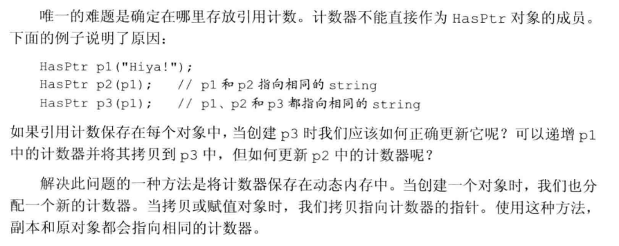
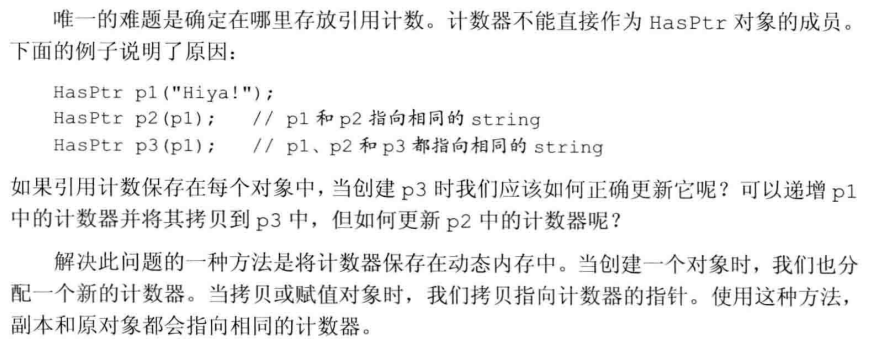
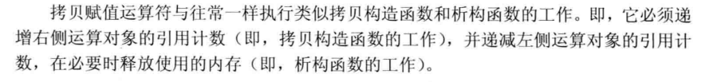
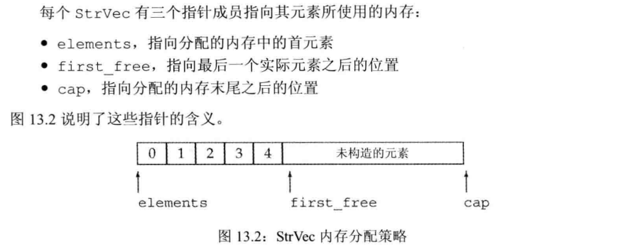
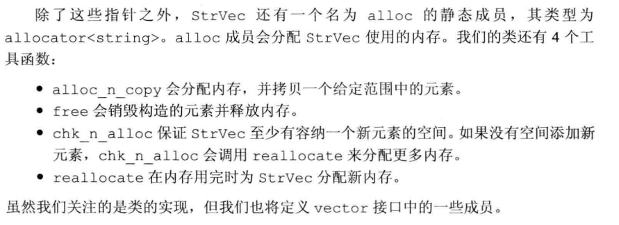

### 第十三章 拷贝控制

#### 1、重载赋值运算符

> 拷贝赋值运算符是一个名为 `operator=` 的函数，当赋值运算发生时就会用到它。合成拷贝赋值运算符可以用来禁止该类型对象的赋值。
>
> 可以选择性的拷贝成员变量

```cpp
class A{
    A();
    A& operator = (const A&);
}
//标准库中通常要求容器中的类型具有赋值运算符，返回一个相同对象的引用

//若自己不写重载赋值运算符，系统默认的称为：合成拷贝赋值运算符
A& A::operator=(const A &rhs){
    id = rhs.id;
    return *this;
}
A a,b;
a = b;
```

&nbsp;

&nbsp;

#### 2、智能指针 shared_ptr() 的简单复现





> 计数器思想：保存在动态内存中
>
> - 当创建一个新的对象，分配一个地址
> - 拷贝和赋值时，原对象和副本都指向相同的计数器

```cpp
class HasPtr{
public:
    //分配新的计数器，置1
	HasPtr(const std::string& s = std::string()) :ps(new std::string(s)), i(0), use(new size_t(1)) {}
    //拷贝构造
    HasPtr(const HasPtr &p):ps(p.ps), i(p.i), use(p.use){
        ++*use;
    }
    
    HasPtr& operator = (const HasPtr& );
    ~HasPtr();
    
private:
    std::string *ps;
    int i;
    int *use;			//用来记录有多少对象共享*ps的成员
};
```

> 其中具体的实现：
>
> 

```cpp
HasPtr& operator = (const HasPtr& rhs){
    ++*rhs.use;
    if (--*use == 0)		//析构部分，由于是拷贝别人的到自己的
    {
        delete ps;
        delete use;
    }
    ps = rhs.ps;
    i = rhs.i;
    use = rhs.use;			//计数器指向同一片内存区域
    return *this;
}

~HasPtr()
{
    if (--*use == 0)
    {
        delete ps;
        delete use;
    }
}

int get_use(){
    return *use;
}


int main() {
    auto a = HasPtr("hi");
    auto b = a;
    cout << b.get_use() << endl;		// 2


    return 0;
}
```

&nbsp;

&nbsp;

#### 3、基于动态内存管理的 `Vector<string>`的底层复现

##### brief：





```cpp
class StrVec{
public:
    //构造函数、拷贝、赋值运算符、析构
    StrVec(): elements(nullptr), first_free(nullptr), cap(nullptr){}   
    strVec(const StrVec &);
    strVec &operator = (const StrVec &);
    ~StrVec();
    
    void push_back(const std::string &);
    size_t size() const {return first_free - elements;}
    size_t capacity() const {return cap - elements;}
    
    std::string *begin() const {return elements;}
    std::string *end() const {return first_free};
    
private:
    static std::allocator<std::string> alloc;	//分配元素
    
    //分配更多的内存
    void chk_n_alloc(){
        if(size() == capacity())
            reallocate();
    }
    
    //分配内存
    std::pair<std::string*, std::string*> alloc_n_copy(
    			const std::string*, const std::string*);
    
    void free();				//释放内存
    void reallocate();			//获得更多内存并拷贝已有元素
    
    //三个指针
    std::string *elements;
    std::string *first_free;
    std::string *cap;
};

```


page 493