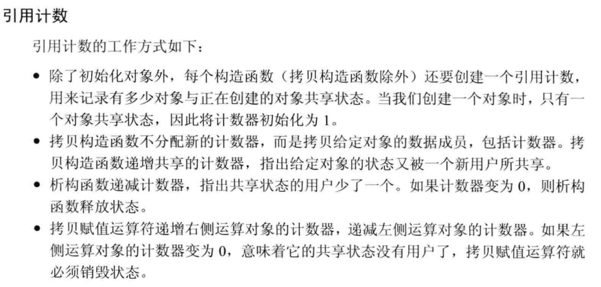

### 第十三章 拷贝控制

#### 1、重载赋值运算符

> 拷贝赋值运算符是一个名为 `operator=` 的函数，当赋值运算发生时就会用到它。合成拷贝赋值运算符可以用来禁止该类型对象的赋值。
>
> 可以选择性的拷贝成员变量

```cpp
class A{
    A();
    A& operator=(const A&);
}
//标准库中通常要求容器中的类型具有赋值运算符，返回一个相同对象的引用

//若自己不写重载赋值运算符，系统默认的称为：合成拷贝赋值运算符
A& A::operator=(const A &rhs){
    id = rhs.id;
    return *this;
}
A a,b;
a = b;
```

> **疑问：赋值操作符为什么要返回引用类型？**
>
> 试想 Test a,b,c;
>
> a = b = c;
>
> 这里存在连续赋值，这是符合C++的语法规范的；
>
> 如果赋值操作符不是返回的一个引用；
>
> 那么 在b=c调用复制操作符之后就会再次调用拷贝构造函数返回一个临时对象temp ；
>
> 然后 a=temp 再调用赋值操作符，增加了一次拷贝的代价。

&nbsp;

&nbsp;

#### 2、智能指针 shared_ptr() 的简单复现




> 计数器思想：保存在动态内存中
>
> - 当创建一个新的对象，分配一个地址
> - 拷贝和赋值时，原对象和副本都指向相同的计数器

```cpp
class HasPtr{
public:
    //分配新的计数器，置1
	HasPtr(const std::string& s = std::string()) :ps(new std::string(s)), i(0), use(new size_t(1)) {}
    //拷贝构造
    HasPtr(const HasPtr &p):ps(p.ps), i(p.i), use(p.use){
        ++*use;
    }
    
    HasPtr& operator = (const HasPtr& );
    ~HasPtr();
    
private:
    std::string *ps;
    int i;
    int *use;			//用来记录有多少对象共享*ps的成员
};
```

> 其中具体的实现：
>
> 

```cpp
HasPtr& operator = (const HasPtr& rhs){
    ++*rhs.use;
    if (--*use == 0)		//析构部分，由于是拷贝别人的到自己的
    {
        delete ps;
        delete use;
    }
    ps = rhs.ps;
    i = rhs.i;
    use = rhs.use;			//计数器指向同一片内存区域
    return *this;
}

~HasPtr()
{
    if (--*use == 0)
    {
        delete ps;
        delete use;
    }
}

int get_use(){
    return *use;
}


int main() {
    auto a = HasPtr("hi");
    auto b = a;
    cout << b.get_use() << endl;		// 2


    return 0;
}
```

&nbsp;

&nbsp;

#### 3、基于动态内存管理的 `Vector<string>`的底层复现

##### brief：


```cpp
class StrVec{
public:
    //构造函数、拷贝、赋值运算符、析构
    StrVec(): elements(nullptr), first_free(nullptr), cap(nullptr){}   
    strVec(const StrVec &);
    strVec &operator = (const StrVec &);
    ~StrVec();
    
    void push_back(const std::string &);
    size_t size() const {return first_free - elements;}
    size_t capacity() const {return cap - elements;}
    
    std::string *begin() const {return elements;}
    std::string *end() const {return first_free};
    
private:
    static std::allocator<std::string> alloc;	//分配元素
    
    //分配更多的内存，跳转到reallocate()
    void chk_n_alloc(){
        if(size() == capacity())
            reallocate();
    }
    
    //分配内存:主要在构造与拷贝构造中
    std::pair<std::string*, std::string*> alloc_n_copy(
    			const std::string*, const std::string*);
    
    void free();				//释放内存
    void reallocate();			//获得更多内存并拷贝已有元素
    
    //三个指针
    std::string *elements;
    std::string *first_free;
    std::string *cap;
};

```

> 具体实现：

```cpp
// push_back()函数
void StrVec::push_back(const string &s){
    chk_n_alloc();
    alloc.construct(first_free++, s);
}
//使用allocator类的construct函数分配空间


std::pair<std::string*, std::string*> StrVec::alloc_n_copy(
           const std::string *e, const std::string *f){
	auto data = alloc.allocate(f - e);
    return {data,  uninitialized_copy(e,f,data)};
}

// e,f => 代表string.begin(), string.end()
//返回的是elements、first_free
```

> allocator类用法如下：


```cpp
//释放内存函数
void StrVec::free()
{
    //先析构已经分配的对象，再deallocate释放内存地址
    if(elements){
        for (auto p = first_free; p!=elements; ){
            alloc.destroy(--p);
        }
        alloc.deallocate(elements, cap - elements);
    }
}

//构造函数
StrVec::StrVec(const StrVec &s)
{
    auto newdata = alloc_n_copy(s.begin(), s.end());
    elements = newdata.first;
    first_free = cap = newdata.second;
}

//析构函数
StrVec::~StrVec(){
    free();
}

//拷贝赋值运算符
StrVec &StrVec::operator=(const StrVec &rhs){
    auto data = alloc_n_copy(rhs.begin(), rhs.end());
    free();
    elements = data.first;
    first_free = cap = data.second;
    return *this;
}
```


> **关于 std::move()** in `<utility>`

```cpp
void StrVec::reallocate(){
    //先将容量放大为原来的两倍
    auto newcapacity = (size()==0) ? 1 : size()*2;
    //分配新内存
    auto newdata = alloc.allocate(newcapacity);
    //创建指针分别指向 新数组首部 和 旧数组首部
    auto dest = newdata;
    auto elem = elements;
    
    //将数据从旧内存移动到新内存
    for (size_t i=0; i!=size(); i++){
        alloc.construct(dest++, std::move(*elem++));
    }
    
    free();
    
    elements = newdata;
    first_free = dest;
    cap = elements + newcapacity;
    
}
```

&nbsp;

&nbsp;

#### 4、右值引用

##### 1、概念

> 左值：lvalue 表示一个占据内存中某个可识别地址的对象。
>
> 右值：rvalue 一个表达式不是 左值 就是 右值，当前不存在于内存地址当中的值

##### 2、右值的性质

> 只能绑定到一个将要销毁的对象；
>
> 一般的引用&都是左值引用；
>
> 而右值引用：双引用符号&&  或  const type &
>
> 区别就在于绑定到的是未分配地址空间的变量，如乘法等；
>
> 左值持久，右值短暂

```cpp
int i = 42;
int &r1 = i;				//左值引用
int &&r2 = i * 42;			//右值引用
const int &r3 = i * 42;		//右值引用，const
int &r4 = i * 42;			//错误，纯单引用是左值
int &&r5 = i;				//错误，i是确定的，不能右值引用
```

##### 3、std::move()函数

> 可以将一个左值显式地转换为对应的右值引用类型；
>
> **调用std::move意味着：**
>
> **除了对r1赋值或销毁它，我们将不再使用它！**
>
> 调用move之后，我们不能使用移后源对象的值

```cpp
int &&r6 = std::move(r1);
```


page 509


