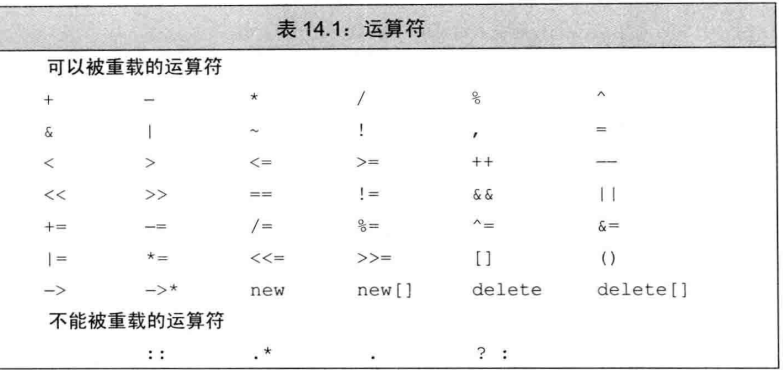

#### 1、基本概念

> 重载运算符：由关键字 **operator** 和 **其后要定义的运算符号**共同组成
>
> 参数数量：与该运算符作用的运算对象数量一样多
>
> 对于一个运算符函数来说，它或者是类的成员，或是至少含有一个类类型的参数

不能重定义内置运算符，即参数都跟系统内置的一模一样：

```cpp
int operator+(int, int);		//错误
int operator+(Myclass &s1, Myclass &s2);	//正确

string s = "h1" + s1;
//等价于
string s = operator+("hi" + s1);
```

> 能够被重载的运算符：




#### 2、运算符作为成员函数或非成员函数（友元）

##### 准则与规范：

> 成员函数：
>
> - 赋值=，下标[]，调用()，箭头成员访问 ->
> - 自增++，自减--，解引用*，复合操作 +=，-=
>
> 成员函数可以使用this，友元不能
>
> 非成员函数：（友元）
>
> - 输入>>、输出<<
> - 算数运算符：加减乘除余幂
> - 关系运算符：==(等于)，!= (不等于)，< (小于)，> (大于)，<=(小于等于)，>=(大于等于)
> - 位运算符：| (按位或)，& (按位与)，~(按位取反)，^(按位异或),，<< (左移)，>>(右移)


#### (1) 非友元函数

##### 1、复合运算符：成员函数

```cpp
//类内定义
Sales_data& operator+=(const Sales_data&);

//类外函数体
Sales_data& Sales_data::operator+=(const Sales_data &rhs)
{
	units_sold += rhs.units_sold;
	revenue += rhs.revenue;
	return *this;
}

//一般都是返回引用，返回值是 *this，函数体内部的都是私有变量的更新
```


##### 2、赋值运算符：成员函数

```cpp
Sales_data& operator=(const Sales_data &obj) 
{
    name = obj.name; 
    return *this; 
};

//重载的成员函数一般都是返回*this
```


##### 3、下标运算符：成员函数

```cpp
class Vec{
public:
    Sales_data& operator[](size_t n)
    {
        return elements[n];
    }
    
private:
    string *elements;
};
```


##### 4、自增、自减：成员函数

```cpp
class myclass
{
public:
    int ls[4];
    int *cur;
    myclass:ls{2,3,1,5},cur(ls){};
    
    // ++myclass重载，返回引用或对象
    myclass &operator++(){ cur ++; return *this;}; 
    
    // myclass++重载，只能返回对象(不允许返回局部对象的引用)
    myclass operator++(int){ myclass tmp(*this); cur ++; return tmp;}; 
    
};
```


##### 5、解引用和箭头访问：成员函数

```cpp
class cls
{
    public:
        void show(int p){cout << p << endl;};
}

class myclass
{
    public:
        myclass:sp(p) (cls *p)
        cls &operator*(){return *sp;} // 解引返回具体类
        cls *operator->(){return sp;} // 箭头返回类指针，实际使用时返回的指针会立刻再做系统的箭头操作

        const cls &operator*() const {return *sp;} // const重载版本
        const cls *operator->() const {return sp;} // const重载版本
    private:
        cls *sp;
};

cls a;

myclass t(&a) ;

cls b = *t ; // 调用解引操作符，返回cls类对象

t->show(3) ; // 调用箭头操作符，调用cls对象的show()方法,此时t是对象而不是指针,如果t是指针，则会调用系统解引和箭头操作：

cls *j = &t;

*j ; // 返回 myclass对象

j->show(3) ; // 调用myclass对象的show方法，本例中myclass没有定义方法，运行时报错
```


##### 6、函数调用操作符：成员函数

```cpp
class myclass
{
    public:
        int operator() (int i)
        {
            return i + 2;
        }
};


//特点：括号
myclass obj;
int j = obj(5) ; // 使用调用操作符重载函数 j = 7
```


#### (2) 友元函数

##### 关于友元函数：

> - 类内加friend定义
> - 类外定义：不用加friend
> - 类外写函数体：不用加friend


##### 1、算数运算符：（非成员函数）（友元）

```cpp
//类外定义
Sales_data operator+(const Sales_data&, const Sales_data&);

//类内定义
friend Sales_data operator+(const Sales_data&, const Sales_data&);

//类外写入函数体
Sales_data operator+(const Sales_data &lhs, const Sales_data &rhs)
{
	Sales_data sum = lhs;
	sum += rhs;
	return sum;
}

//基本是两个参数，都是引用实参,返回值是个对象
```


##### 2、输入操作符：（友元）

```cpp
friend istream& operator>>(istream &is, Myclass &s1)
{
    //参数s1不加const，要修改
    is >> s1.id >> s1.name >> s1.price;
    if(is){			//if success
        ...
    }
    else{
        s1 = Myclass();		//输入失败，要恢复默认状态
    }
    return is;
}


//use
Myclass s1;
cin >> s1;
// 命令行输入要依据id、name、price顺序读入
```


##### 3、输出操作符：（友元）

```cpp
friend ostream& operator<<(ostream &os, const Myclass &s1){
    os << s1.name << " " << s1.getprice() << endl;
}


//use
Myclass s1;
cout << s1 << endl;		//类似于java的toString
```


##### 4、关系运算符：（友元）

###### 1、相等运算符

```cpp
bool operator==(const A &s1, const A &s2){
    return s1.name == s2.name &&
        s1.id == s2.id;
}

bool operator!=(const A &s1, const A &s2){
    return !(s1 == s2);			//写法便捷
}
```

###### 2、关系运算符

```cpp
bool operator<(const A &s1, const A &s2){
    return s1.id < s2.id;
}
```

