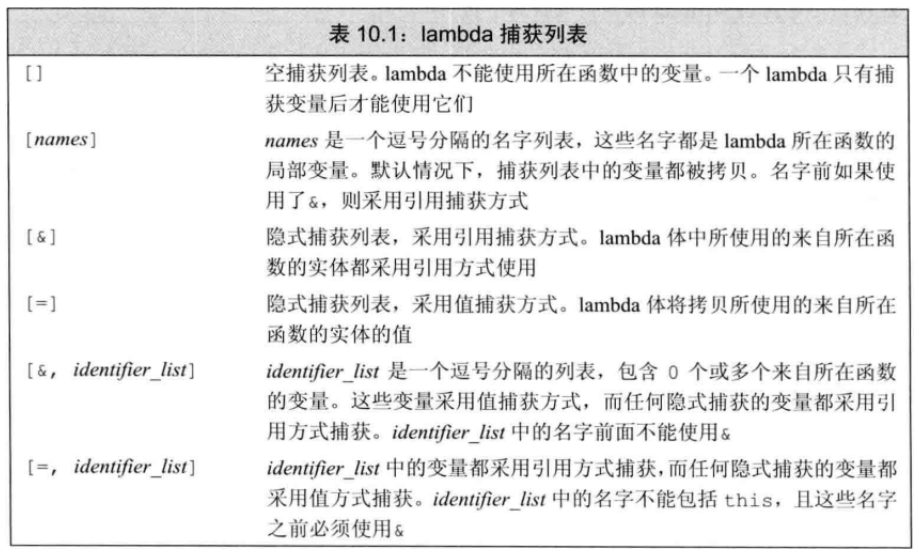

#### 泛型算法：generic algorithm

可以用于不同类型的元素和多种容器类型，并且实现了经典算法的公共接口

 

#### lambda表达式：表示一个可调用的代码单元

##### 1、具体格式：

```
[capture list](parameter list) -> return type{ function }
```

例子：

```cpp
//例1：定义一个可调用对象f
auto f = [] {return 42;}
cout << f() << endl; 		//print:42
```

##### 2、向lambda传参

​	编译一个与isShorter函数功能相同的lambda

```cpp
[](const string &a, const string &b){
    return a.size() < b.size();
}

//use in main
sort( words.begin(), 
      words.end(), 
      [](const string &a, const string &b){
          return a.size() < b.size();}
     );


/*
空捕获列表：表名此lambda不使用它所在的函数中的局部变量；
返回值是bool
```

##### 3、使用捕获列表 capture list

​	lambda表达式**只有**在捕获列表中捕获一个**当前函数内的局部变量**，才能在函数体中使用该变量

​	例：编写表达式，使得能将输入序列中每个string的长度与func函数中的sz参数的值比较

```cpp
[sz](const string &a){
    return a.size() >= sz;
}

//其中capture list可以用逗号隔开
//接下来我们查找一个长度大于等于sz的元素
//调用find_if：获取一个迭代器，指向第一个size()大于等于sz的元素

auto wc = find_if(words.begin() , words.end(), 
                  [sz](const string &a){ return a.size() >= sz;}
                 );

//完整的func函数
void func(std::vector<std::string> &words, size_t sz){
    auto wc = find_if(words.begin() , words.end(),
                      [sz](const std::string &a){ return a.size() >= sz;}
    );
    std::cout << wc - words.begin() << std::endl;
}

```

##### 4、隐式捕获

​	指示编译器推断捕获列表，应在捕获列表中写一个**"&"或"="**

> &：采用的是引用形式的捕获方式
>
> =：采用的是值形式的捕获方式

```cpp
//上面的例子：
auto wc = find_if(words.begin() , words.end(), 
                  [=](const string &a){ return a.size() >= sz;}
                 );

//混合捕获方式
for_each(words.begin(), words.end(),
         [&, c](const string &s) { os << s << c;});
//其中，&为隐式捕获os，c为显示捕获一个值
```

**经典的捕获列表：**




##### 5、transform函数

```cpp
transform(first, last, result, op);	 

/*
first：容器1的首迭代器，second：容器1的尾迭代器
result：存放结果容器的首部
op：一元操作函数  */

// 例：将容器words中所有字符全变成大写放入容器v2中
char op(char c){
    return toupper(c);
}

vector<char> words(N),v2(N);
transform(words.begin(), words.end(), v2.begin(), op);
```


##### 6、定义一个lambda表达式的返回值

```c++
//1、没有返回值的lambda表达式，表达式里只有return
transform(words.begin(), words.end(), v2.begin(),
                [](char s){
                    return toupper(s);
                }
          );

//2、当表达式里有其它语句时，要用带有返回值的lambda来操作
// [](char s) -> char{...} 
transform(words.begin(), words.end(), v2.begin(),
                [](char s) -> char {
                    if(s!='a')
                        return toupper(s);
                    else
                        return s;
                }
          );


//注意：vector在初始化时v1(10),那么下次push_back是在第11个位置上
```

