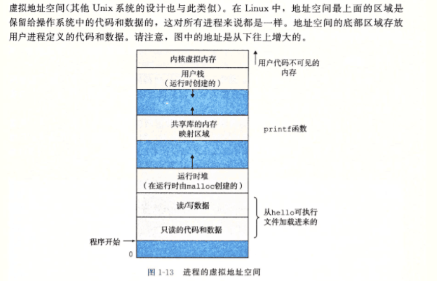
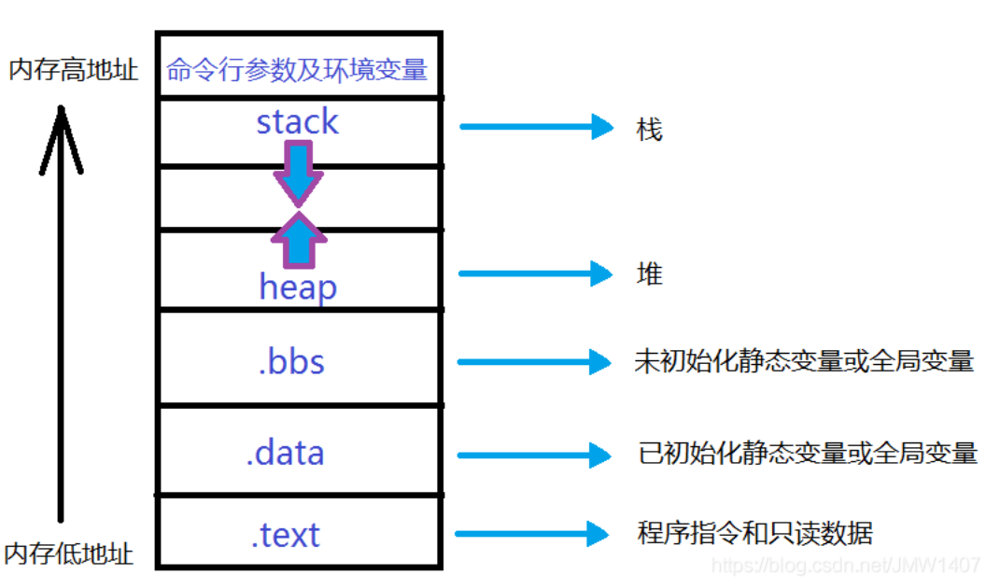

#### 1、内存中的栈区和堆区

栈区特点：由操作系统自动分配和释放，有限

堆区：需要手动申请和释放

堆是向高地址扩展的数据结构，是**不连续的内存区域**。

| 栈区                                           | 堆区                                                         |
| ---------------------------------------------- | ------------------------------------------------------------ |
| Stack memory内存空间由操作系统自动分配和释放。 | Heap Memory内存空间**手动申请和释放**的，Heap Memory内存常用**new关键字来分配**。 |
| Stack Memory内存空间有限。                     | Heap Memor的空间是很大的自由区几乎没有空间限制。             |

举例：

```cpp
#include <iostream>
int main()
{
    int i = 10;               //变量i储存在栈区中
    char pc[] = "hello!";     //储存在栈区
    const double cd = 99.2;   //储存在栈区
    static long si = 99;      //si储存在可读写区，专门用来储存全局变量和静态变量的内存
    int* pi = new int(100);   //指针pi指向的内存是在堆区，专门储存程序运行时分配的内存
	//...
    delete pi;                //需程序员自己释放
    return 0;
}
```

 



​     

​      

#### 2、Java中的堆与栈

- 声明的对象是先在栈内存中为其分配地址空间，
- 在对其进行实例化后则在堆内存中为其分配地址。

```java
Person p = null 	// 只在Stack Memory中为其分配地址空间
p = new Person(); 	//后在Heap Memory中为其分配内存地址
```

​	堆内存用来存放**由 new 创建的对象和数组**，在堆中分配的内存，由 Java 虚拟

机的自动垃圾回收器来管理。

​    

#### 3、Linux中的进程地址空间的组成

##### a)内核空间

​	这块区域包含两种数据，一种是对每个进程都一样的数据，如共享的内核代码

和全局数据结构。另一种是每个进程都不一样的数据，如页表、内核在进程上下

文中执行代码时使用的栈，以及记录该进程虚拟地址空间当前组织状态的各种数

据结构。

##### b)系统栈：向低地址方向（向下）

内存由编译器在需要时自动分配和释放。通常用来存储**局部变量**和**函数形参**。

为运行函数而分配的**局部变量**、函数参数、返回地址等存放在栈区。

##### c)共享库的内存映射区域：向高地址方向（向上）

共享库.so/.dll在内存中的映射地址

##### d)系统堆：向高地址方向（向上）

内存使用new进行分配，使用delete或delete[]释放。

如果未能对内存进行正确的释放，会造成内存泄漏。

但在程序结束时，会由操作系统自动回收。

使用malloc进行分配，使用free进行回收的区域

##### e)全局/静态存储区

.data节：全局变量 + static变量

​    



 

 

 

Reference：《基础知识篇——堆内存和栈内存》https://blog.csdn.net/qq_41498261/article/details/83583466